# Architecture

## Signal flow

```mermaid
flowchart LR
    IN[Input] --> LOOKAHEAD[Lookahead delay]
    IN --> SCHPF[SC HPF<br/>20-500 Hz]
    SCHPF --> LINK[Stereo-linked<br/>max&#124;.&#124;]
    LINK --> ENV[Peak envelope<br/>follower]
    ENV --> GATE[Hysteresis comparator<br/>+ hold timer]
    GATE --> RAMP[Attack/Release<br/>gain ramp]
    RAMP -->|gain, dB domain| MULT((x))
    LOOKAHEAD --> MULT
    MULT --> OUT[Output]
```

The detection path (SC HPF through the gain ramp) never touches the audio that reaches the output; it only computes a single, stereo-linked gain value per sample. The main path is just the input delayed by Lookahead, multiplied by that gain. This split - detection path vs. main path - lives entirely inside `GateEngine` (`src/dsp/GateEngine.{h,cpp}`).

## Module map

| Directory | Responsibility |
|---|---|
| `src/dsp` | All audio-thread DSP: `GateEngine`, the complete detection + gain-computer + lookahead signal chain. No allocation, locks, or I/O once `prepare()` has run. Independent of `juce::AudioProcessor` so it is directly unit-testable (see `tests/GateEngineTests.cpp`). |
| `src/params` | Parameter layout and `AudioProcessorValueTreeState` definitions - parameter IDs, ranges, defaults. Single source of truth for what a preset captures. |
| `src/PluginProcessor.*` | Host plumbing: APVTS construction, `prepareToPlay`/`processBlock`/`reset`, latency reporting, state save/load. Reads APVTS values and pushes them into `GateEngine` every block; does not implement any DSP itself. |
| `src/PluginEditor.*` | A simple, functional v0.1 GUI: one rotary slider per parameter bound via `SliderAttachment`. A custom vector-drawn GUI is a later milestone. |

Dependency direction is one-way: `PluginEditor` -> `params` (via attachments) and `PluginProcessor` -> `params` + `dsp`. `src/dsp` has no upward dependency on the processor or UI, which is what keeps `GateEngine` testable in isolation.

## Gain computer: hysteresis, hold, attack/release

The gate uses two thresholds, not one:

- **Open threshold** = the user-facing `Threshold` parameter.
- **Close threshold** = `Threshold - 3 dB` (a fixed internal offset, `GateEngine::hysteresisDb`, not user-exposed).

A closed gate only opens once the envelope rises to or above the open threshold. Once open, it only closes once the envelope has stayed below the *close* threshold for the full `Hold` time. This dead band between the two thresholds is what prevents chatter: a signal hovering anywhere between them (below the open threshold but above the close threshold) can never *retrigger* a closed gate, but also can never *close* an already-open one - see `tests/GateEngineTests.cpp`'s hysteresis test, which asserts both halves of that asymmetry directly.

`Hold` is implemented as a per-sample countdown that is continuously retriggered while the envelope stays above the close threshold; it only starts counting down once the envelope drops below the close threshold, and the gate closes only once it reaches zero. This is what keeps the gate open across the brief dips between consecutive palm-muted chugs.

`Attack` and `Release` are ramp *times* (time to cross the full `Range` span, the same convention used for compressor ballistics), applied in the dB domain to a single `currentGainDb` state variable that chases a `targetGainDb` of either `0 dB` (open) or `Range` (closed) every sample.

`Range = 0 dB` is a special, useful case: the target gain is `0 dB` whether the gate is open or closed, so the whole engine degenerates to a pure delay regardless of `Threshold`/envelope behaviour - this is the "always open" reference passthrough used by `tests/GateEngineTests.cpp`'s null test.

## Envelope detection

The detection signal is derived from a **copy** of the input (never the input buffer itself):

1. A sidechain-only high-pass filter (`SC HPF`, `juce::dsp::IIR::Filter` via `ProcessorDuplicator`, Butterworth Q, 20-500 Hz) removes hum/rumble that would otherwise falsely hold the gate open. This filter is never applied to the main signal.
2. The (now filtered) channels are combined per-sample via `max(|channel|)` across all channels - a stereo-linked combine, so a signal panned hard to one side alone can still open the gate, and the gate's gain, applied identically to every channel, never shifts the stereo image.
3. That mono signal is fed through `juce::dsp::BallisticsFilter` in `peak` mode with a fixed, non-user-exposed ballistic (0.3 ms attack / 15 ms release) - fast enough to catch transients almost immediately without itself chattering on a bumpy sustained signal. This is a different, faster ballistic than the user-facing `Attack`/`Release`, which shape the *gain ramp*, not the envelope.

## Lookahead and latency

`Lookahead` delays only the **main** signal path (`juce::dsp::DelayLine<float, DelayLineInterpolationTypes::None>`, exact integer-sample delay, no interpolation smearing) so the gate's gain ramp can start rising slightly before a transient's leading edge actually reaches the output - the classic lookahead-gate trick for catching fast picking transients without an audible attack chirp.

Lookahead is treated as a **structural** parameter, the same way an oversampling factor is in a different plugin design: its value at the moment `prepare()` runs determines both the delay line's applied delay and `GateEngine::getLatencySamples()`'s reported value for the life of that prepared session. `setLookaheadMs()` can be called at any time (including from the audio thread, since it is just a plain float store, no allocation), but a change only takes effect the next time `prepare()` runs (in practice, the next host `prepareToPlay()` call) - this keeps the reported host latency always exactly consistent with the delay actually applied, without ever calling `AudioProcessor::setLatencySamples()`/`updateHostDisplay()` (neither of which is safe to call from the audio thread) from inside `process()`.

`SilentiumAudioProcessor::prepareToPlay()` reports `engine.getLatencySamples()` via `setLatencySamples()` so host-side plugin delay compensation (PDC) accounts for it. There is no separate dry path to compensate in this plugin - unlike a dry/wet effect, the "dry" signal here *is* the (delayed) main path; there is nothing else to align it against.

## Parameter smoothing

- **Range** and **SC HPF** are smoothed with `juce::SmoothedValue` (`Linear` for the dB-domain `Range`, `Multiplicative` for the frequency-domain `SC HPF`) over a fixed 50 ms window, and re-derived once per block (`rangeSmoothed.skip()`/`scHighpassSmoothed.skip()`) rather than per sample, since recomputing IIR coefficients involves trig calls and is not cheap enough to do every sample.
- **Threshold**, **Attack**, **Hold**, and **Release** only affect the discrete gate state machine's decision boundaries and ramp *rates* - a block-rate step in one of these does not itself multiply the audio signal (unlike `Range`), so they are applied directly without additional smoothing.
- All smoothers/state are seeded from the *current* commanded value in `GateEngine::prepare()` (see `lastRangeDb`/`lastScHighpassHz` etc.), so re-preparing (a sample-rate change, for instance) never resets a live parameter back to a built-in default.

## Real-time safety

- `SilentiumAudioProcessor::processBlock()` starts with `juce::ScopedNoDenormals`.
- All DSP state (the SC HPF, the envelope follower, the lookahead delay line, and the scratch detection/mono-envelope buffers) is allocated in `GateEngine::prepare()`/`AudioProcessor::prepareToPlay()` and never reallocated on the audio thread.
- `reset()` clears all filter/envelope/delay-line state without deallocating (`GateEngine::reset()`, called from both `AudioProcessor::reset()` and internally from `prepare()`), including fully zeroing the lookahead delay line's buffered samples (`juce::dsp::DelayLine::reset()` clears its internal buffer) - so state never leaks across a reset, including any pathological input the delay line might have been holding.
- Parameter values are read via `apvts.getRawParameterValue()` atomics in `processBlock()`, never via `apvts.getParameter()->getValue()` (not guaranteed lock/allocation-free) and never via `String`-keyed lookups on the audio thread.
- `GateEngine::process()` treats a zero-sample block as a safe no-op before touching any filter/envelope/delay-line state.
- Filter cutoff frequencies passed to `IIR::Coefficients::makeHighPass` are clamped below Nyquist (`clampBelowNyquist`, in `GateEngine.cpp`) as defensive insurance against invalid coefficients if the plugin is ever prepared at an unusually low sample rate.
