# Architecture

## Signal flow

```mermaid
flowchart LR
    IN[Main input] --> LOOKAHEAD[Lookahead delay]
    IN --> DETSRC{Sidechain bus<br/>enabled + connected?}
    SC[Sidechain input] --> DETSRC
    DETSRC -->|main input, self-detection| SCHPF[SC HPF<br/>20-500 Hz]
    DETSRC -->|external sidechain| SCHPF
    SCHPF --> SCLPF[SC LPF<br/>1-16 kHz, v0.2.0]
    SCLPF --> LINK[Stereo-linked<br/>max&#124;.&#124;]
    LINK --> ENV[Peak envelope<br/>follower]
    ENV --> GATE[Hysteresis comparator<br/>+ hold timer]
    GATE --> KNEE[Knee blend]
    KNEE --> DUCK{Duck?}
    DUCK -->|no: gate| RAMP[Program-dependent<br/>attack/release gain ramp]
    DUCK -->|yes: invert| RAMP
    RAMP -->|gain, dB domain| MULT((x))
    LOOKAHEAD --> MULT
    SCLPF -.->|Listen enabled: bypasses gain computer| OUT[Output]
    MULT -->|Listen disabled| OUT
```

The detection path (SC HPF through the gain ramp) never touches the audio that reaches the output, with one deliberate exception: **Listen** mode, which substitutes the SC-filtered detection signal for the gain computer's output so the detector's trigger signal can be auditioned directly (see [Listen mode](#listen-mode) below). Ordinarily it only computes a single, stereo-linked gain value per sample; the main path is just the input (or, with the sidechain bus enabled and connected, keyed off that instead) delayed by Lookahead, multiplied by that gain. This split - detection path vs. main path - lives entirely inside `GateEngine` (`src/dsp/GateEngine.{h,cpp}`).

**v0.2.0** adds a second, independent sidechain-only filter stage (**SC LPF**, in series after SC HPF) and replaces the fixed-slope Attack/Release ramp with a program-dependent exponential one - see [SC LPF: narrowing the detection band](#sc-lpf-narrowing-the-detection-band) and [Program-dependent attack/release ramp](#program-dependent-attackrelease-ramp) below, and `docs/design-brief.md` for the full sourcing/reasoning.

## Module map

| Directory | Responsibility |
|---|---|
| `src/dsp` | All audio-thread DSP: `GateEngine`, the complete detection + gain-computer + lookahead signal chain. No allocation, locks, or I/O once `prepare()` has run. Independent of `juce::AudioProcessor` so it is directly unit-testable (see `tests/GateEngineTests.cpp`). |
| `src/params` | Parameter layout and `AudioProcessorValueTreeState` definitions - parameter IDs, ranges, defaults. Single source of truth for what a preset captures. |
| `src/PluginProcessor.*` | Host plumbing: APVTS construction, `prepareToPlay`/`processBlock`/`reset`, latency reporting, state save/load. Reads APVTS values and pushes them into `GateEngine` every block; does not implement any DSP itself. |
| `src/PluginEditor.*` | A simple, functional v0.1 GUI: one rotary slider per float parameter bound via `SliderAttachment`, one `ToggleButton` per bool parameter (`Duck`, `Listen`) bound via `ButtonAttachment`, plus (v0.2.0) the `PresetBar` strip docked at the top. A custom vector-drawn GUI is a later milestone; `SC LPF` has no dedicated knob yet in this editor by design (see `docs/design-brief.md` §7 - "No GUI changes are in scope here (M3)"), though it is fully controllable via host automation/generic editor and presets. |
| `src/presets` | The M2 preset system: `PresetManager` (factory/user preset discovery, load/save/import/export, dirty tracking, default resolution) and `PresetBar` (the editor strip), plus `Localisation` (the i18n frame). Copied verbatim from `basilica-audio/nave`'s pilot implementation - see [M2 preset system](#m2-preset-system) below. |

Dependency direction is one-way: `PluginEditor` -> `params` (via attachments) + `presets` and `PluginProcessor` -> `params` + `dsp` + `presets`. `src/dsp` has no upward dependency on the processor or UI, which is what keeps `GateEngine` testable in isolation; `src/presets` has no dependency on `src/dsp` either.

## Gain computer: hysteresis, hold, attack/release

The gate uses two thresholds, not one:

- **Open threshold** = the user-facing `Threshold` parameter.
- **Close threshold** = `Threshold - 3 dB` (a fixed internal offset, `GateEngine::hysteresisDb`, not user-exposed).

A closed gate only opens once the envelope rises to or above the open threshold. Once open, it only closes once the envelope has stayed below the *close* threshold for the full `Hold` time. This dead band between the two thresholds is what prevents chatter: a signal hovering anywhere between them (below the open threshold but above the close threshold) can never *retrigger* a closed gate, but also can never *close* an already-open one - see `tests/GateEngineTests.cpp`'s hysteresis test, which asserts both halves of that asymmetry directly.

`Hold` is implemented as a per-sample countdown that is continuously retriggered while the envelope stays above the close threshold; it only starts counting down once the envelope drops below the close threshold, and the gate closes only once it reaches zero. This is what keeps the gate open across the brief dips between consecutive palm-muted chugs.

`Attack` and `Release` govern how a single `currentGainDb` state variable chases a `targetGainDb` computed every sample by the knee/duck stage below - see [Program-dependent attack/release ramp](#program-dependent-attackrelease-ramp) for the exact v0.2.0 mechanism (a v0.1.0-era fixed dB/sample slope).

`Range = 0 dB` is a special, useful case: with `Knee = 0 dB` and `Duck` off, the target gain is `0 dB` whether the gate is open or closed, so the whole engine degenerates to a pure delay regardless of `Threshold`/envelope behaviour - this is the "always open" reference passthrough used by `tests/GateEngineTests.cpp`'s null test.

## Program-dependent attack/release ramp

v0.1.0's `Attack`/`Release` ramp was a fixed dB/sample slope, `rate = (0 - Range) / timeSamples`, computed once from the *full* `Range` span and applied identically regardless of how far the current gain actually sat from its target. v0.2.0 replaces this with an exponential approach: every sample, the distance from `currentGainDb` to `targetGainDb` shrinks by a fixed multiplier (`GateEngine::processChunk()`'s `attackMultiplier`/`releaseMultiplier`, `GateEngine.cpp`), calibrated so a *full* `Range`-span transition reaches within `GateEngine::rampCloseEnoughDb` (0.5 dB) of its target in the user-facing `Attack`/`Release` time - matching v0.1.0's contract for a full-scale transition exactly. Because the multiplier itself doesn't depend on how large the actual transition is, a *partial* transition (e.g. a signal that only dipped slightly under the close threshold, or a knee-blended target that isn't a full 0 dB/`Range` swing) reaches that same absolute tolerance in proportionally fewer samples than a full-scale one - the "program dependent" behaviour ISP's Time Vector Integration and dbx's AutoDynamic both cite as their headline differentiator (`docs/design-brief.md` §1-2), reproduced here as a plausible, testable mechanism rather than either vendor's (undisclosed) proprietary algorithm - see `docs/design-brief.md`'s honesty section. `tests/DesignBriefTests.cpp`'s ramp-proof test verifies this property directly. A sustained note (envelope staying open, target staying at 0 dB) converges to and then sits flush at the target with no periodic re-modulation, by construction - the conservative interpretation of "eliminates modulation of sustained notes" this brief committed to where the spec underdetermined the exact curve shape.

## SC LPF: narrowing the detection band

v0.2.0 adds `SC LPF` (`ParamIDs::scLowpass`, 1-16 kHz, default 16 kHz), a second sidechain-only IIR low-pass in series after `SC HPF` (`GateEngine::scLowPass`, same allocation-free per-block coefficient recompute pattern as `SC HPF` - see [Real-time safety](#real-time-safety)). Together they let the detection path be narrowed toward the guitar pick-attack transient band (roughly 2-5 kHz, `docs/design-brief.md` §1.2/§3) instead of only rejecting hum/rumble below `SC HPF`'s corner. At its default (16 kHz, effectively fully open at typical sample rates), `SC LPF` is inert - `tests/DesignBriefTests.cpp`'s SC LPF null test verifies a v0.2.0 engine with `SC LPF` left at its default reproduces v0.1.0's null-test result exactly, so a session that never touches the new parameter behaves identically to before (tolerant import - see [State/versioning](#state-and-versioning) below).

## Knee: soft-knee blend

`GateEngine::process()` computes an `openness` value in `[0, 1]` every sample (`0` = fully closed target, `1` = fully open target), then maps it to `targetGainDb = juce::jmap(openness, rangeDbNow, 0.0f)`:

- **`Knee == 0 dB`** (the default): `openness = gateOpen ? 1.0f : 0.0f` - an exact reproduction of the original v0.1 hard-knee target, snapping instantly between `Range` and `0 dB` at the hysteresis comparator's decision.
- **`Knee > 0 dB`**: `openness` is instead a smoothstep of the envelope's position within a band of width `Knee` centred on `Threshold` (`lastThresholdDb - Knee/2` to `lastThresholdDb + Knee/2`), blending the target smoothly across that band rather than snapping.

**Hold still overrides the blend**: whenever `gateOpen && holdCounterSamples > 0`, `openness` is forced to `1.0f` regardless of the knee curve's instantaneous value. Without this, a signal dipping into the knee band during a Hold window could sag the gain, defeating the entire purpose of Hold (bridging brief envelope dips between transients without a chatter/sag). This override is unconditional and applies identically whether `Knee` is `0` or wide.

## Duck: inverting the target

If `Duck` is enabled, `openness` is inverted (`openness = 1.0f - openness`) *after* the hysteresis/hold/knee stage above, reusing the exact same detection path, comparator, hold timer, and knee blend. The practical effect: the output attenuates toward `Range` while the detector is above `Threshold` (instead of opening above it), and passes near-unity while the detector is below `Threshold`. Hold's full-open override still applies pre-inversion, so during a Hold window in Duck mode the target is fully *attenuated* (not fully open) for Hold's whole duration - i.e. Hold still bridges the same envelope dips, just for the ducked state instead of the gated one. `isGateOpen()` always reports the underlying detector's hysteresis/hold state, unaffected by `Duck` - this is what lets `tests/GateEngineTests.cpp`'s existing hysteresis tests keep passing unmodified, since `Duck` defaults to `false`.

## Listen: auditioning the detector

If `Listen` is enabled, `GateEngine::process()` still runs the full detection path and the full gain computer (so toggling `Listen` doesn't disturb any other state, e.g. the lookahead delay line's contents), but the final per-sample output substitutes the SC-filtered detection signal (post SC HPF, pre envelope-follower, per-channel - not the mono envelope) for `delayed * gainLinear`. This lets a user audition exactly what the detector hears while dialling in `SC HPF`/`Threshold`, including the stereo image of the filtered signal (not a mono blob).

## Envelope detection

The detection signal is derived from a **copy** of either the main input, or an external sidechain input if one was supplied to `process()` and is usable (see [External sidechain input](#external-sidechain-input) below) - never the main input buffer itself, which must stay untouched until the final per-sample gain-multiply/lookahead step:

1. A sidechain-only high-pass filter (`SC HPF`, `juce::dsp::IIR::Filter` via `ProcessorDuplicator`, Butterworth Q, 20-500 Hz) removes hum/rumble that would otherwise falsely hold the gate open. This filter is never applied to the main signal.
2. **(v0.2.0)** A second sidechain-only low-pass filter (`SC LPF`, same `ProcessorDuplicator` pattern, 1-16 kHz, default 16 kHz/effectively off) runs in series right after `SC HPF`, letting the detection band be narrowed toward the pick-attack transient region - see [SC LPF: narrowing the detection band](#sc-lpf-narrowing-the-detection-band).
3. The (now filtered) channels are combined per-sample via `max(|channel|)` across all channels - a stereo-linked combine, so a signal panned hard to one side alone can still open the gate, and the gate's gain, applied identically to every channel, never shifts the stereo image.
4. That mono signal is fed through `juce::dsp::BallisticsFilter` in `peak` mode with a fixed, non-user-exposed ballistic (0.3 ms attack / 15 ms release) - fast enough to catch transients almost immediately without itself chattering on a bumpy sustained signal. This is a different, faster ballistic than the user-facing `Attack`/`Release`, which shape the *gain ramp*, not the envelope.

## External sidechain input

`SilentiumAudioProcessor` declares a second input bus, `"Sidechain"` (`juce::AudioChannelSet::stereo()`, disabled by default - see the `BusesProperties` chain in the constructor). `isBusesLayoutSupported()` accepts that bus as disabled, mono, or stereo, independent of the main bus's own mono/stereo choice - a mono kick-drum sidechain triggering a stereo guitar gate is a normal, supported configuration.

`processBlock()` slices the host-provided combined buffer into the main bus's view (`getBusBuffer(buffer, false, 0)`) and the sidechain bus's view (`getBusBuffer(buffer, true, 1)`), both allocation-free (JUCE 8.0.14, `juce::AudioProcessor::getBusBuffer` constructs its returned `AudioBuffer` from existing channel pointers, no heap allocation). It then calls `GateEngine::process(mainBlock, sidechainBlockPtr)`, where `sidechainBlockPtr` is `nullptr` whenever the sidechain view has zero channels - which covers every "no sidechain" case (bus never enabled, the default; bus enabled but nothing routed into it by the host) with no extra branching.

`GateEngine::process()`'s `sidechainBlock` parameter, when non-null with a matching sample count and at least one channel, replaces the usual `detectionSub.copyFrom(block)` self-detection copy with a copy from the sidechain block instead. If the sidechain has fewer channels than the detection path (e.g. mono sidechain, stereo instance), the last available sidechain channel is reused ("splatted") for the remaining detection channels, so every detection channel always has a meaningful, freshly-written signal rather than stale data from a previous block.

The main signal path itself - the audio that gets delayed, gated/ducked, and sent to the output - is *always* the main bus, regardless of whether an external sidechain is in use; only the detection/trigger source changes.

## Lookahead and latency

`Lookahead` delays only the **main** signal path (`juce::dsp::DelayLine<float, DelayLineInterpolationTypes::None>`, exact integer-sample delay, no interpolation smearing) so the gate's gain ramp can start rising slightly before a transient's leading edge actually reaches the output - the classic lookahead-gate trick for catching fast picking transients without an audible attack chirp.

Lookahead is treated as a **structural** parameter, the same way an oversampling factor is in a different plugin design: its value at the moment `prepare()` runs determines both the delay line's applied delay and `GateEngine::getLatencySamples()`'s reported value for the life of that prepared session. `setLookaheadMs()` can be called at any time (including from the audio thread, since it is just a plain float store, no allocation), but a change only takes effect the next time `prepare()` runs (in practice, the next host `prepareToPlay()` call) - this keeps the reported host latency always exactly consistent with the delay actually applied, without ever calling `AudioProcessor::setLatencySamples()`/`updateHostDisplay()` (neither of which is safe to call from the audio thread) from inside `process()`.

`SilentiumAudioProcessor::prepareToPlay()` reports `engine.getLatencySamples()` via `setLatencySamples()` so host-side plugin delay compensation (PDC) accounts for it. There is no separate dry path to compensate in this plugin - unlike a dry/wet effect, the "dry" signal here *is* the (delayed) main path; there is nothing else to align it against.

## Parameter smoothing

- **Range**, **SC HPF**, and **SC LPF** (v0.2.0) are smoothed with `juce::SmoothedValue` (`Linear` for the dB-domain `Range`, `Multiplicative` for the frequency-domain `SC HPF`/`SC LPF`) over a fixed 50 ms window, and re-derived once per block (`rangeSmoothed.skip()`/`scHighpassSmoothed.skip()`/`scLowpassSmoothed.skip()`) rather than per sample, since recomputing IIR coefficients involves trig calls and is not cheap enough to do every sample.
- **Threshold**, **Attack**, **Hold**, **Release**, and **Knee** only affect the discrete gate state machine's decision boundaries and ramp *rates*/target *shape* - a block-rate step in one of these does not itself discontinuously multiply the audio signal (the already-smooth `Attack`/`Release` ramp still governs how `currentGainDb` reaches whatever `targetGainDb` a Knee change produces), so they are applied directly without additional smoothing.
- **Duck** and **Listen** are plain boolean routing switches (invert the target; substitute the output source), also applied directly - `Duck` only ever changes which side of the already-smoothed ramp a given detector state maps to, and `Listen` is an intentionally instantaneous audition toggle (the same expectation as an SC-listen button on hardware/other gate plugins), not something that needs to fade.
- All smoothers/state are seeded from the *current* commanded value in `GateEngine::prepare()` (see `lastRangeDb`/`lastScHighpassHz` etc.), so re-preparing (a sample-rate change, for instance) never resets a live parameter back to a built-in default.

## Real-time safety

- `SilentiumAudioProcessor::processBlock()` starts with `juce::ScopedNoDenormals`.
- All DSP state (the SC HPF, the envelope follower, the lookahead delay line, and the scratch detection/mono-envelope buffers) is allocated in `GateEngine::prepare()`/`AudioProcessor::prepareToPlay()` and never reallocated on the audio thread.
- `reset()` clears all filter/envelope/delay-line state without deallocating (`GateEngine::reset()`, called from both `AudioProcessor::reset()` and internally from `prepare()`), including fully zeroing the lookahead delay line's buffered samples (`juce::dsp::DelayLine::reset()` clears its internal buffer) - so state never leaks across a reset, including any pathological input the delay line might have been holding.
- Parameter values are read via `apvts.getRawParameterValue()` atomics in `processBlock()`, never via `apvts.getParameter()->getValue()` (not guaranteed lock/allocation-free) and never via `String`-keyed lookups on the audio thread.
- `GateEngine::process()` treats a zero-sample block as a safe no-op before touching any filter/envelope/delay-line state.
- Filter cutoff frequencies for the SC HPF are clamped below Nyquist (`clampBelowNyquist`, in `GateEngine.cpp`) as defensive insurance against invalid coefficients if the plugin is ever prepared at an unusually low sample rate. The block-rate coefficient recomputation in `GateEngine::process()` uses `IIR::ArrayCoefficients<float>::makeHighPass` (a `std::array<float, 6>` returned by value) assigned in place into the existing `scHighPass.state`, deliberately *not* `IIR::Coefficients<float>::makeHighPass`, whose implementation (`return *new Coefficients(...)`, verified against the JUCE 8.0.14 source) heap-allocates a new reference-counted `Coefficients` object on every call - which would otherwise make this per-block recomputation a real-time-safety violation.
- `Knee` is clamped to `[0, maxKneeDb]` in `process()` before use, and the knee-band divide is only reached once `Knee` has already been checked `>= 0.0001f`, avoiding a division by (or near) zero.
- The optional sidechain input is sliced out via `AudioProcessor::getBusBuffer()`, which constructs its returned `AudioBuffer` from existing channel pointers with no heap allocation (verified against the JUCE 8.0.14 source); `GateEngine::process()`'s sidechain-copy path uses `juce::dsp::AudioBlock::copyFrom()`/`getSingleChannelBlock()`, likewise allocation-free.
- **(v0.2.0)** `PresetManager` (`src/presets/PresetManager.{h,cpp}`) is never called from `processBlock()` - it is constructed once in `SilentiumAudioProcessor`'s constructor and otherwise only touched from `PresetBar`'s message-thread-only UI callbacks. Its one audio-thread-adjacent code path, the `AudioProcessorValueTreeState::Listener::parameterChanged()` override used for dirty-flag tracking (JUCE 8.0.14 does not document that callback as guaranteed message-thread-only), is a single lock-free `std::atomic<bool>` store and nothing else.

## State and versioning

`SilentiumAudioProcessor::setStateInformation()` restores a saved `AudioProcessorValueTreeState` via `apvts.replaceState()`. JUCE 8.0.14's `AudioProcessorValueTreeState`/`NormalisableRange` clamp any out-of-range stored value to the parameter's *current* range on load (`NormalisableRange::convertTo0to1()`'s `clampTo0To1`, verified against the JUCE 8.0.14 source) - this is what makes v0.2.0's state handling **tolerant import** without any bespoke migration code: a v0.1.0 session missing the new `scLowpass` ID loads with it at its v0.2.0 `ParameterLayout` default, every pre-existing ID's value is preserved exactly (no ID is renamed/rescaled in v0.2.0), and a hand-edited/future state with `Hold` above the new 250 ms ceiling clamps to 250 ms rather than asserting or wrapping. See `docs/design-brief.md` §7 and `tests/DesignBriefTests.cpp`'s Hold-range and tolerant-import tests.

## M2 preset system

`src/presets/PresetManager.{h,cpp}` + `src/presets/PresetBar.{h,cpp}` implement the suite-wide M2 preset system (`.scaffold/specs/preset-system-m2.md`), copied from `basilica-audio/nave`'s pilot implementation (`docs/preset-system-notes.md` there is the replication recipe) with zero Silentium-specific code beyond the small `PresetManagerConfig`/`FactoryPresetAsset` construction in `PluginProcessor.cpp`. Nine factory presets (`presets/factory/*.json`, embedded via `juce_add_binary_data`) are documented one-line-each in `docs/presets.md`. The M2 i18n frame (`src/presets/Localisation.{h,cpp}`, `resources/i18n/de.txt`) wraps every `PresetBar` frame string in `TRANS()`/`juce::translate()` and selects German automatically from `juce::SystemStats::getUserLanguage()` at editor construction; core/DSP parameter names are never translated anywhere in this plugin.
